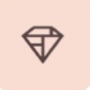

<a name="readme-top"></a>

[![Stargazers][stars-shield]][stars-url]
[![MIT License][license-shield]][license-url]
[![LinkedIn][linkedin-shield]][linkedin-url]

<!-- PROJECT LOGO -->
<br />
<div align="center">
  <a href="https://github.com/asish918/ECommerce-Mobile">
    
  </a>

<h3 align="center">Shrine</h3>

  <p align="center">
   A beautiful E-Commerce mobile app that uses a Material Design case study by Google and fetches data from a backend API using clean MVVM architecture
    <br />
    <br />

[]()

  </p>
</div>

<!-- TABLE OF CONTENTS -->
<details>
  <summary>Table of Contents</summary>
  <ol>
    <li>
      <a href="#about-the-project">About The Project</a>
      <ul>
        <li><a href="#built-with">Built With</a></li>
      </ul>
    </li>
    <li>
      <a href="#getting-started">Getting Started</a>
      <ul>
        <li><a href="#prerequisites">Prerequisites</a></li>
        <li><a href="#installation">Installation</a></li>
      </ul>
    </li>
    <li><a href="#license">License</a></li>
    <li><a href="#contact">Contact</a></li>
  </ol>
</details>

<!-- ABOUT THE PROJECT -->

## About The Project

![Product Name Screen Shot][product-screenshot]

<p align="right">(<a href="#readme-top">back to top</a>)</p>

### Built Using Clean MVVM Architecture

- ![Kotlin][Kotlin]
- ![Android_Studio][Android_Studio]
- ![Jetpack_Compose][Jetpack_Compose]

<p align="right">(<a href="#readme-top">back to top</a>)</p>

<!-- GETTING STARTED -->

## Getting Started

To get a local copy up and running follow these simple example steps.

### Prerequisites

- Android Studio (and default SDKs and tools)

### Installation

1. Setup the E-Commerce Web project. This one is an extension and uses the same backend API configured in the Web project.
2. Clone the repo
   ```sh
   git clone https://github.com/asish918/ECommerce-Mobile.git
   ```
3. Open the project in Android Studio and wait for the Gradle sync up
4. Enter your Base URL in `app/src/main/java/com/example/shrine_ecommerce/utils/Constants.kt`. Remember that you gotta setup the Web Project before this one. Don't skip step 1
5. Build and Run the project.

   <p align="right">(<a href="#readme-top">back to top</a>)</p>

<!-- LICENSE -->

## License

Distributed under the MIT License. See `LICENSE` for more information. Basically you can do whatever the hell you want to with the code 😉

<p align="right">(<a href="#readme-top">back to top</a>)</p>

<!-- CONTACT -->

## Contact

Asish Mahapatra - asishmahapatra918@gmail.com

By the time you stumble upon this app, a lot of libraries might have been deprecated. So make sure you take special care in updating and reworking the code if you are seeing this repo years after it was made.

Project Link: [https://github.com/asish918/ECommerce-Mobile](https://github.com/asish918/ECommerce-Mobile)

<p align="right">(<a href="#readme-top">back to top</a>)</p>

<!-- MARKDOWN LINKS & IMAGES -->
<!-- https://www.markdownguide.org/basic-syntax/#reference-style-links -->

[stars-shield]: https://img.shields.io/github/stars/asish918/ECommerce-Mobile.svg?style=for-the-badge
[stars-url]: https://github.com/asish918/ECommerce-Mobile/stargazers
[license-shield]: https://img.shields.io/github/license/asish918/ECommerce-Mobile.svg?style=for-the-badge
[license-url]: https://github.com/asish918/ECommerce-Mobile/blob/master/LICENSE.txt
[linkedin-shield]: https://img.shields.io/badge/-LinkedIn-black.svg?style=for-the-badge&logo=linkedin&colorB=555
[linkedin-url]: https://linkedin.com/in/asishmahapatra918
[product-screenshot]: readme_assets/banner.jpg
[Kotlin]: https://img.shields.io/badge/Kotlin-7F52FF?style=for-the-badge&logo=kotlin&logoColor=white
[Android_Studio]: https://img.shields.io/badge/Android_Studio-3DDC84?style=for-the-badge&logo=androidstudio&logoColor=white
[Jetpack_Compose]: https://img.shields.io/badge/Jetpack_Compose-4285F4?style=for-the-badge&logo=jetpackcompose&logoColor=white
